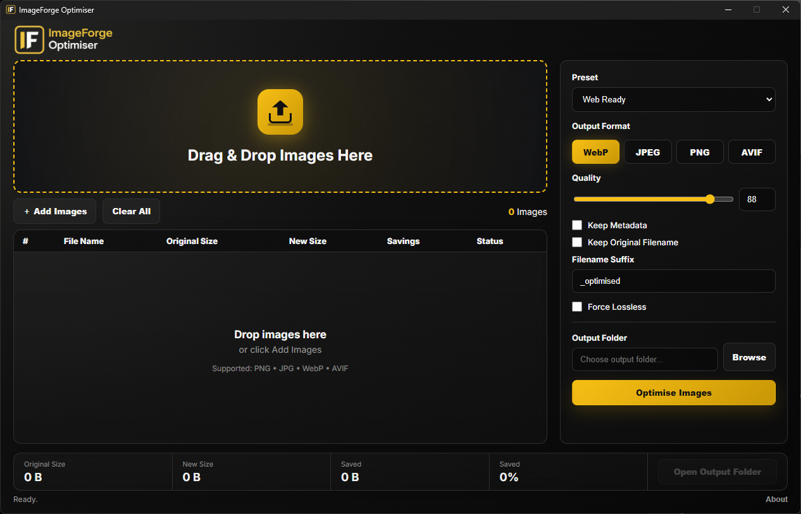
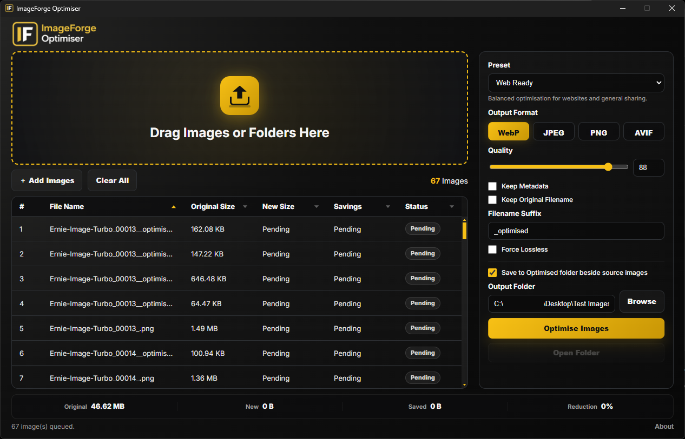
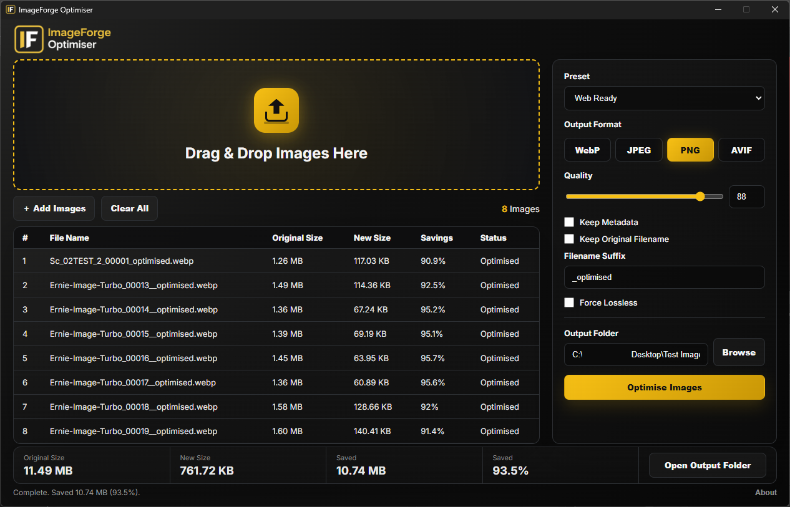

## ImageForge Optimiser

A lightweight Windows desktop application for batch image optimisation and format conversion.

ImageForge Optimiser helps reduce image file sizes while maintaining excellent visual quality. 
Designed for photographers, designers, CGI artists, content creators, 
web developers and anyone who needs fast, simple image optimisation.

## Screenshot

---

## Features

Drag & Drop image processing
Drag & Drop folder processing
Recursive folder scanning
Batch image optimisation
Smart automatic output folders
Automatic creation of an Optimised folder beside source images
Modern dark user interface
WebP export
JPEG export
PNG export
AVIF export
Adjustable quality settings
Lossless mode
File size savings reporting
Batch processing statistics
Portable version available
Windows desktop application
Supported Formats
Input Formats
PNG
JPG
JPEG
WebP
AVIF
Output Formats
PNG
JPEG
WebP
AVIF

## Download

Download the latest Windows release from:

https://github.com/SRadcliffe/imageforge-optimiser/releases

### Recommended Download

**ImageForge-Optimiser-Portable-1.1.0.exe**

Runs immediately with no installation required.

### Alternative Download

**ImageForge-Optimiser-Setup-1.1.0.exe**

Standard Windows installer version.

## Installation

Download the latest release.
Launch ImageForge Optimiser.
Drag images or folders into the application.
Select your preferred format and quality settings.
Click Optimise Images.
Optimised files will be saved automatically.
Usage
Web Ready

Balanced optimisation for websites, portfolios and general online content.

Smallest File

Maximum compression for the smallest practical file size.

High Quality

Light compression while preserving visual quality.

Lossless

No quality loss where supported by the selected format.

Custom

Manual control over format, quality and output settings.

## Version History

## v1.1.0
Added
Folder drag-and-drop support
Recursive folder scanning
Smart automatic output folder creation
Automatic Optimised folder generation beside source images
Portable build distribution
Improved
File list handling for larger batches
Application workflow
Output folder management
Build and release packaging
User interface polish
Fixed
PNG export handling
JPEG export handling
AVIF export handling
Output format selection behaviour
Smart output folder workflow
## v1.0.1
Fixed
PNG export now correctly saves PNG files
JPEG export now correctly saves JPEG files
AVIF export now correctly saves AVIF files
Output format selection now correctly respects the user's chosen format
General stability improvements
## v1.0.0

Initial public release.

## Features
Batch image optimisation
WebP support
PNG support
JPEG support
AVIF support
Quality controls
Lossless mode
Windows installer
Built With
Electron
Sharp
Electron Builder
JavaScript
HTML
CSS
Roadmap

## Planned improvements:

Image thumbnails
Before/After image comparison
Sortable results table
Status badges
Watch folder mode
Windows right-click integration
Additional export presets
Compression estimation

## Development

Clone the repository:

git clone https://github.com/SRadcliffe/imageforge-optimiser.git
cd imageforge-optimiser

Install dependencies:

npm install

Run locally:

npm start

Build Windows release:

npm run dist:win

Build output will be generated in:

## release/License

MIT License

## Author

Simon Radcliffe

Creative Technologist

Website:
https://siradcliffe.uk

GitHub:
https://github.com/SRadcliffe